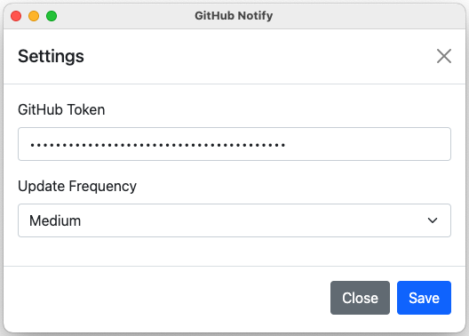

# GitHub Notify

> Simple tray application for getting GitHub notifications


[](https://goreportcard.com/report/github.com/koltyakov/github-notify)
[](https://github.com/koltyakov/github-notify/blob/master/LICENSE)

| | |
|-|-|
| macOS |  |
| Windows |  |

**Scenario**

- I'm a maintainer or active watcher of some repositories at GitHub
- I want to react to issues quickly
- I prefer a status based humble info rather than agressive email or pop-ups
- My daily driver is macOS machine
- I prefer default Safari for browsing

## Demo


## Install

```bash
go get github.com/koltyakov/github-notify
```

## Config

- Generate [GitHub access token](https://github.com/settings/tokens) (better select only Notifications access).
- Provive the token in settings form.



## Run

### macOS/Linux

```bash
nohup github-notify >/dev/null 2>&1 &
```

### Windows

Run `github-notify.exe`.

## Build

### Prerequisites

The project uses these major dependencies and inherits their prerequisites:
- [systray](https://github.com/getlantern/systray)
- [Lorca](https://github.com/zserge/lorca)

### Build command

```bash
make build
```