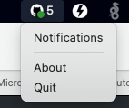
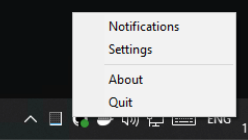
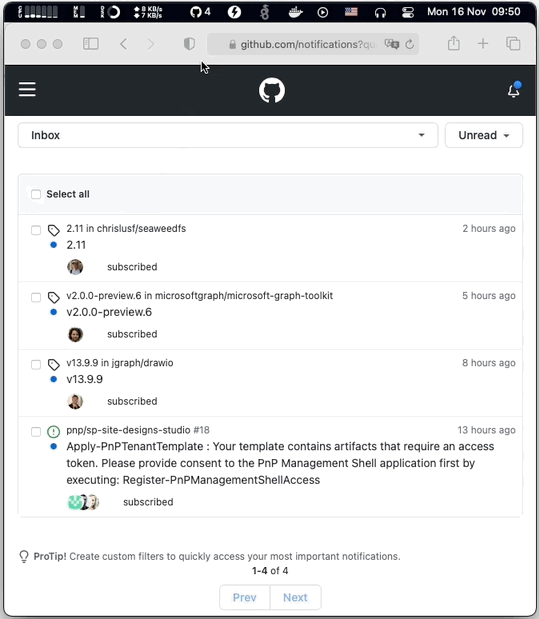

# GitHub Notify

> Simple tray application for getting GitHub notifications

| | |
|-|-|
| macOS |  |
| Windows |  |

**Scenario**

- I'm a maintainer or active watcher of some repositories at GitHub
- I want to react to issues quickly
- I prefer a status based humble info rather than agressive email or pop-ups
- My daily driver is macOS machine
- I prefer default Safari for browsing

## Demo



## Build

```bash
make build
```

## Config

- Generate [GitHub access token](https://github.com/settings/tokens) (better select only Notifications access).
- Provive the token in settings form.

## Run

```bash
./bin/github-notify &
```