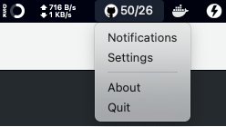

# GitHub Notify

> Simple tray application for getting GitHub notifications


[](https://goreportcard.com/report/github.com/koltyakov/github-notify)
[](https://github.com/koltyakov/github-notify/blob/master/LICENSE)

| | |
|-|-|
| macOS |  |
| Windows |  |
| Linux |  |

**Scenario**

- I'm a maintainer or active watcher of some repositories at GitHub
- I want to react to issues quickly
- I prefer a status based humble info rather than agressive email or pop-ups

## Demo


## Install

```bash
go get github.com/koltyakov/github-notify
```

## Config

- Generate [GitHub access token](https://github.com/settings/tokens) (better select only Notifications access).
- Provive the token in settings form.


## Run

### macOS

Install from `.dmg` and run as any other application.

### Windows

Just run `github-notify.exe`.

### Linux run

```bash
nohup github-notify >/dev/null 2>&1 &
```

### From sources

```bash
make start
```

## Build

### Build command

```bash
make build-darwin
make build-win
make build-linux
```

**Prerequisites**

The project uses these major dependencies and inherits their prerequisites:

- [systray](https://github.com/getlantern/systray)
- [Lorca](https://github.com/zserge/lorca)

Due to the nature of `systray` package, the build for macOS can be done in a Mac, a linux build only on a Linux machine. Platform specific prerequisites are required.

Windows cross build can be done from any platform.

### App bundle (for macOS)

```bash
make bundle-darwin
```

As a result, the `.dmg` installer image should be found in `./dist` folder.